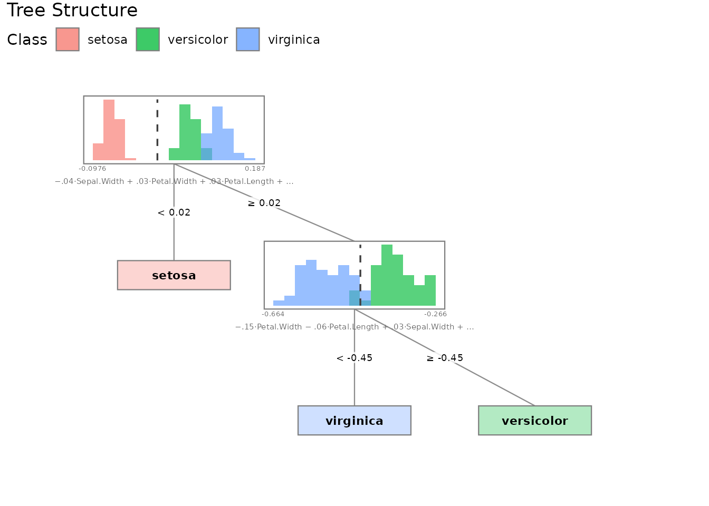
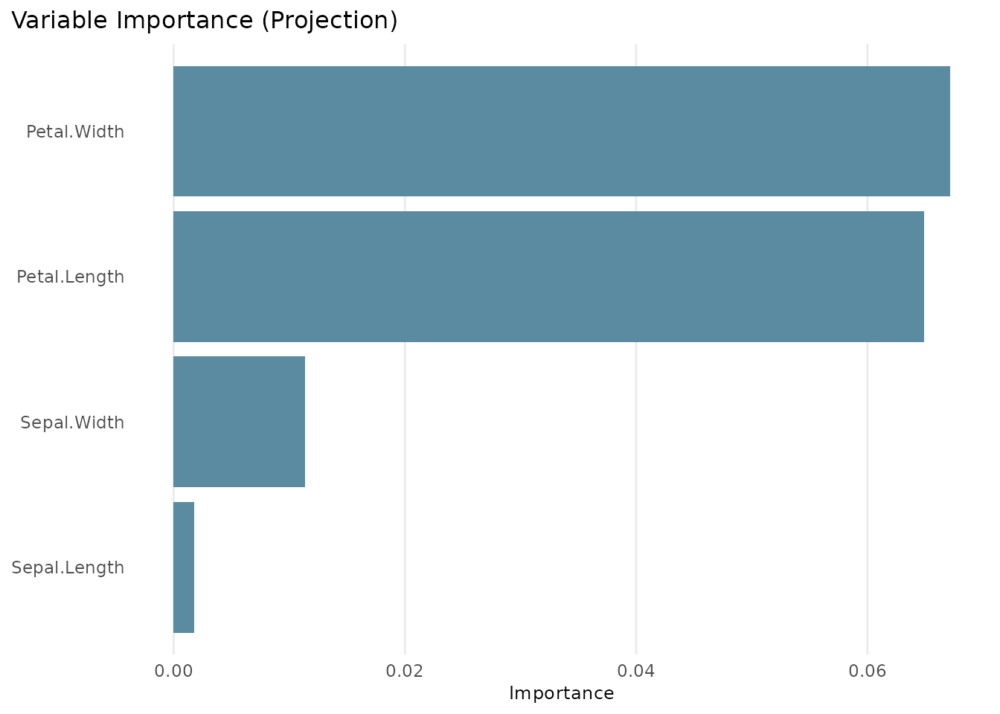
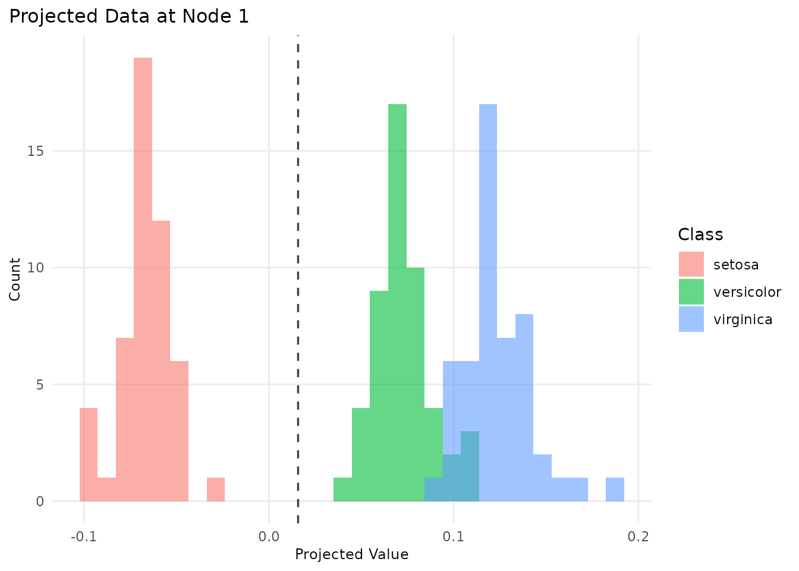
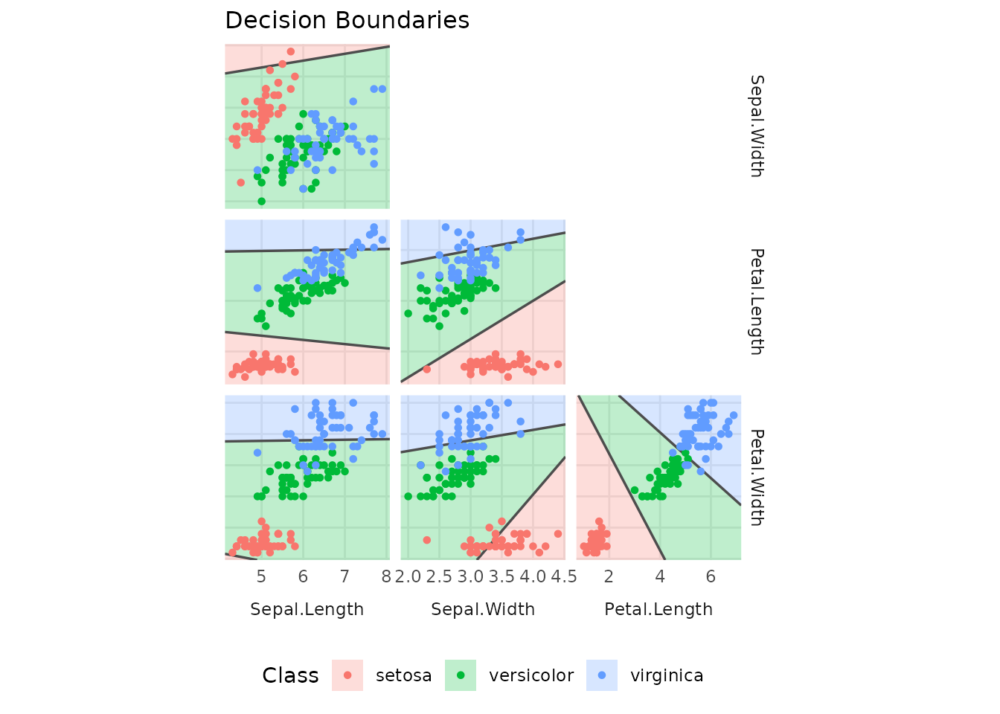
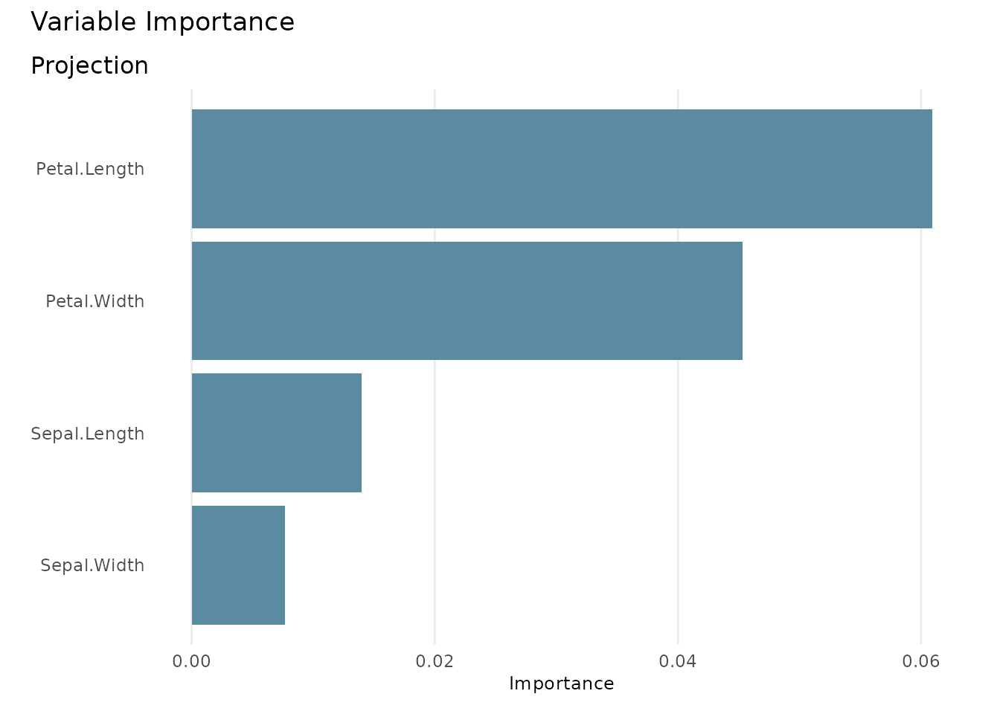
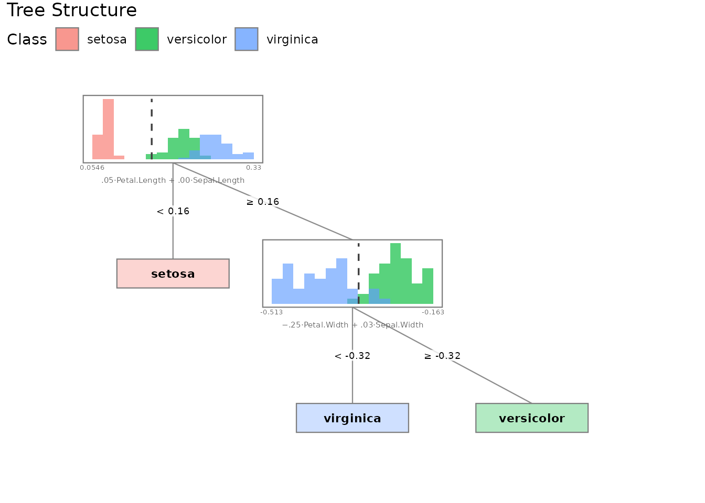

# Introduction to ppforest2

ppforest2 builds oblique decision trees and random forests using
projection pursuit. Instead of splitting on a single variable at each
node, it finds a linear combination of variables that best separates the
groups.

## Single tree

Train a projection-pursuit tree on the iris dataset:

``` r
library(ppforest2)

tree <- pptr(Species ~ ., data = iris, seed = 0)
tree
#> 
#> Call: pptr(formula = Species ~ ., data = iris, seed = 0)
#> 
#> Projection-Pursuit Oblique Decision Tree:
#> If ([ 0 -0.04 0.03 0.03 ] * x) < 0.01580044:
#>   Predict: setosa 
#> Else:
#>  If ([ 0 0.03 -0.06 -0.15 ] * x) < -0.4503323:
#>    Predict: virginica 
#>  Else:
#>    Predict: versicolor
```

The tree splits on linear projections of the features. Use
[`summary()`](https://rdrr.io/r/base/summary.html) to see variable
importance:

``` r
summary(tree)
#> 
#> Projection-Pursuit Oblique Decision Tree
#> 
#> pp method: PDA (lambda=0.5)
#> vars method: All variables
#> cutpoint method: Mean of means
#> stop rule: Pure node
#> binarize method: Largest gap
#> grouping method: By label
#> leaf method: Majority vote
#> 
#> 
#> Data Summary:
#>   observations: 150 
#>   features:     4 
#>   groups:       3 
#>   group names:  setosa, versicolor, virginica 
#>   formula:      Species ~ Sepal.Length + Sepal.Width + Petal.Length + Petal.Width -      1 
#> 
#> Confusion Matrix:
#> 
#>             Predicted
#> Actual       setosa versicolor virginica
#>   setosa         50          0         0
#>   versicolor      0         47         3
#>   virginica       0          3        47
#> 
#> Training error: 4%
#> 
#> Variable Importance:
#> 
#>       Variable         σ  Projection
#> 1  Petal.Width 0.7622377 0.067165621
#> 2 Petal.Length 1.7652982 0.064908713
#> 3  Sepal.Width 0.4358663 0.011343628
#> 4 Sepal.Length 0.8280661 0.001772132
#> 
#> Note: Variable importance was calculated using scaled coefficients (|a_j| * σ_j).
#> Variable contributions can only be theoretically interpreted as such
#> if the model was trained on scaled data. Scaling also changes the
#> projection-pursuit optimization, which may affect the resulting tree.
```

Predict new observations:

``` r
preds <- predict(tree, iris)
table(predicted = preds, actual = iris$Species)
#>             actual
#> predicted    setosa versicolor virginica
#>   setosa         50          0         0
#>   versicolor      0         47         3
#>   virginica       0          3        47
```

## Random forest

Train a forest of 100 trees, each considering 2 randomly chosen
variables at each split:

``` r
forest <- pprf(Species ~ ., data = iris, size = 100, n_vars = 2, seed = 0)
summary(forest)
#> 
#> Random Forest of Projection-Pursuit Oblique Decision Trees
#> 
#> Size: 100 trees
#> pp method: PDA (lambda=0.5)
#> vars method: Uniform random (count=2)
#> cutpoint method: Mean of means
#> stop rule: Pure node
#> binarize method: Largest gap
#> grouping method: By label
#> leaf method: Majority vote
#> 
#> 
#> Data Summary:
#>   observations: 150 
#>   features:     4 
#>   groups:       3 
#>   group names:  setosa, versicolor, virginica 
#>   formula:      Species ~ Sepal.Length + Sepal.Width + Petal.Length + Petal.Width -      1 
#> 
#> Training Confusion Matrix:
#> 
#>             Predicted
#> Actual       setosa versicolor virginica
#>   setosa         50          0         0
#>   versicolor      0         48         2
#>   virginica       0          5        45
#> 
#> Training error: 4.67%
#> 
#> OOB Confusion Matrix:
#> 
#>             Predicted
#> Actual       setosa versicolor virginica
#>   setosa         50          0         0
#>   versicolor      0         48         2
#>   virginica       0          4        46
#> 
#> OOB error: 4%
#> 
#> Variable Importance:
#> 
#>       Variable         σ  Projection    Weighted   Permuted
#> 1 Petal.Length 1.7652982 0.060925536 0.044617556 0.31747234
#> 2  Petal.Width 0.7622377 0.045294985 0.035571091 0.24510610
#> 3 Sepal.Length 0.8280661 0.013997004 0.006649137 0.06048262
#> 4  Sepal.Width 0.4358663 0.007664503 0.005792385 0.03662244
#> 
#> Note: Variable importance was calculated using scaled coefficients (|a_j| * σ_j).
#> Variable contributions can only be theoretically interpreted as such
#> if the model was trained on scaled data. Scaling also changes the
#> projection-pursuit optimization, which may affect the resulting tree.
```

The summary shows the OOB (out-of-bag) error estimate and three variable
importance measures:

- **Projection**: average absolute projection coefficient across all
  splits
- **Weighted**: projection importance weighted by the number of
  observations routed through each node
- **Permuted**: decrease in OOB accuracy when each variable is permuted

Predict with class probabilities:

``` r
probs <- predict(forest, iris[1:5, ], type = "prob")
probs
#>   setosa versicolor virginica
#> 1      1          0         0
#> 2      1          0         0
#> 3      1          0         0
#> 4      1          0         0
#> 5      1          0         0
```

## Visualization

ppforest2 provides several plot types via
[`plot()`](https://rdrr.io/r/graphics/plot.default.html) (requires
ggplot2):

``` r
# Tree structure with projected data histograms at each node
plot(tree, type = "structure")
```



``` r
# Variable importance bar chart
plot(tree, type = "importance")
```



``` r
# Data projected onto the first split's projection vector
plot(tree, type = "projection")
```



``` r
# Decision boundaries for two selected variables
plot(tree, type = "boundaries")
```



For forests, variable importance is the only global visualization
available. Individual trees can be plotted by specifying a `tree_index`.

``` r
plot(forest)
```



``` r
plot(forest, type = "structure", tree_index = 1)
```



## Regularization with PDA

Set `lambda > 0` to use Penalized Discriminant Analysis instead of LDA.
This can help when features are highly correlated:

``` r
tree_pda <- pptr(Species ~ ., data = iris, lambda = 0.5, seed = 0)
summary(tree_pda)
#> 
#> Projection-Pursuit Oblique Decision Tree
#> 
#> pp method: PDA (lambda=0.5)
#> vars method: All variables
#> cutpoint method: Mean of means
#> stop rule: Pure node
#> binarize method: Largest gap
#> grouping method: By label
#> leaf method: Majority vote
#> 
#> 
#> Data Summary:
#>   observations: 150 
#>   features:     4 
#>   groups:       3 
#>   group names:  setosa, versicolor, virginica 
#>   formula:      Species ~ Sepal.Length + Sepal.Width + Petal.Length + Petal.Width -      1 
#> 
#> Confusion Matrix:
#> 
#>             Predicted
#> Actual       setosa versicolor virginica
#>   setosa         50          0         0
#>   versicolor      0         47         3
#>   virginica       0          3        47
#> 
#> Training error: 4%
#> 
#> Variable Importance:
#> 
#>       Variable         σ  Projection
#> 1  Petal.Width 0.7622377 0.067165621
#> 2 Petal.Length 1.7652982 0.064908713
#> 3  Sepal.Width 0.4358663 0.011343628
#> 4 Sepal.Length 0.8280661 0.001772132
#> 
#> Note: Variable importance was calculated using scaled coefficients (|a_j| * σ_j).
#> Variable contributions can only be theoretically interpreted as such
#> if the model was trained on scaled data. Scaling also changes the
#> projection-pursuit optimization, which may affect the resulting tree.
```

## Explicit strategy selection

For more control, you can pass strategy objects directly instead of
using the shortcut parameters (`lambda`, `n_vars`, `p_vars`). This is
equivalent but makes the strategy choice explicit:

``` r
# These two calls produce identical results:
forest_shortcut <- pprf(Species ~ ., data = iris, size = 10, lambda = 0.5, n_vars = 2, seed = 0)

forest_explicit <- pprf(Species ~ ., data = iris, size = 10, pp = pp_pda(0.5), vars = vars_uniform(n_vars = 2), seed = 0)

all.equal(predict(forest_shortcut, iris), predict(forest_explicit, iris))
#> [1] TRUE
```

Available strategy constructors:

- `pp_pda(lambda)` — PDA projection pursuit (`lambda = 0` for LDA)
- `vars_uniform(n_vars)` or `vars_uniform(p_vars)` — random variable
  selection
- [`vars_all()`](https://andres-vidal.github.io/ppforest2/v0.1.2/r/reference/vars_all.md)
  — use all variables (default for single trees)
- [`cutpoint_mean_of_means()`](https://andres-vidal.github.io/ppforest2/v0.1.2/r/reference/cutpoint_mean_of_means.md)
  — midpoint split rule (default)

Strategy objects can also be passed as engine arguments in parsnip:

``` r
library(parsnip)

spec <- pp_rand_forest(trees = 10) |>
  set_engine("ppforest2", pp = pp_pda(0.5), vars = vars_uniform(n_vars = 2)) |>
  set_mode("classification")

fit <- spec |> fit(Species ~ ., data = iris)
predict(fit, iris[1:5, ])
#> # A tibble: 5 × 1
#>   .pred_class
#>   <fct>      
#> 1 setosa     
#> 2 setosa     
#> 3 setosa     
#> 4 setosa     
#> 5 setosa
```

## Tidymodels integration

ppforest2 integrates with the tidymodels ecosystem via parsnip:

``` r
library(parsnip)

# Single tree
spec <- pp_tree(penalty = 0.5) |>
  set_engine("ppforest2") |>
  set_mode("classification")

fit <- spec |> fit(Species ~ ., data = iris)
predict(fit, iris[1:5, ])
#> # A tibble: 5 × 1
#>   .pred_class
#>   <fct>      
#> 1 setosa     
#> 2 setosa     
#> 3 setosa     
#> 4 setosa     
#> 5 setosa
```

``` r
# Random forest
spec <- pp_rand_forest(trees = 50, mtry = 2, penalty = 0.5) |>
  set_engine("ppforest2") |>
  set_mode("classification")

fit <- spec |> fit(Species ~ ., data = iris)
predict(fit, iris[1:5, ], type = "prob")
#> # A tibble: 5 × 3
#>   .pred_setosa .pred_versicolor .pred_virginica
#>          <dbl>            <dbl>           <dbl>
#> 1            1                0               0
#> 2            1                0               0
#> 3            1                0               0
#> 4            1                0               0
#> 5            1                0               0
```
